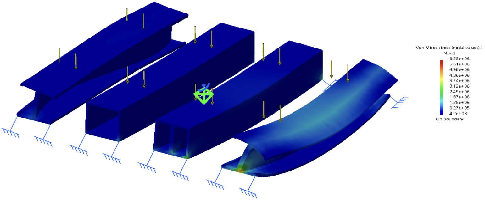

# Alex Ye  
Mechanical Engineering | Composites | Structural Analysis

## Composite Structural Research – SAMPE Bridge Project

### Project Duration – 
  January - April 2025

### Project Overview - 
  I worked with a team to design and construct various composite bridge elements. We started with CATIA models we designed of different beam types, and generated a flexural analysis for each one. Using this information, we manufactured and performed a three-point bend test for each part.

### Objectives -
  - To design industry-grade composite bridge beams able to withstand the requirements specified by the SAMPE Student Bridge Contest.
  - Prove the workability and the feasibility of cost-effective and easily manufacturable composite bridge elements.

### Personal Role - 
  I was tasked with the design of the CATIA models for each beam type. The CAD models served as the basis for the flexural analysis, enabling iterative refinement of geometry prior to composite fabrication.

### CAD Design -

Sketch in CATIA Used to Design I-beam

### Flexural Analysis -

Flexural Analysis of Each Beam Design

### Three-Point Bend Test

Three-Point Bend Test on I-Beam Prototype

### Results -
  - Manufactured working I-beam and square beam composite bridge elements.
  - Both composite elements and preceding prototypes satisfied and exceeded the SAMPE specified requirements for the competition.
  - Team finished second place at Purdue Spring 2025 Undergraduate Research Conference.
